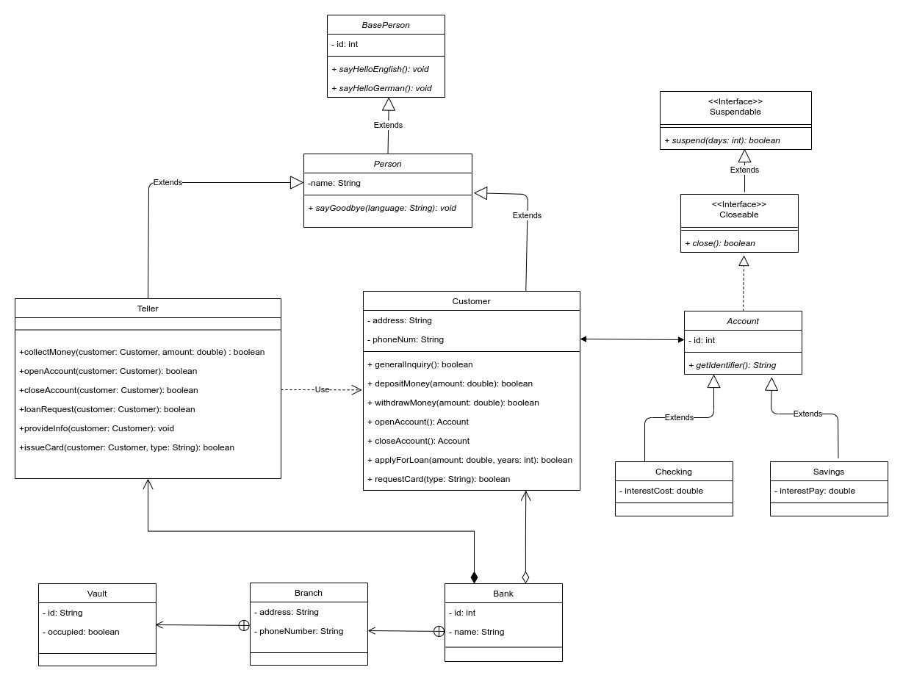

# Generator service

M2Z Tool Suite service for code generation from draw.io UML class diagrams

## Features

- Detects the type of the class (class, interface, abstract)

- Detects the properties and methods of the class

- Generates getters and setters for the properties

- Detects whether the method is abstract or not; if it is, it is generated in the subclass

- Generates methods from interfaces in the subclass

- Detects the relationships (extends, implements, association, aggregation, composition) between the classes and checks if they are correct

- Generates inner classes

## Class diagram example

<div style="display: inline-block">
    
</div>

## Class tree example

```json
{
  "id-class": {
    "type": "class | interface | abstract",
    "inner": "true | false"
    "name": ""
    "properties": {
      "id-property": {
        "access": "public | private | protected"
        "name": "",
        "type": "",
      }
    },
    "methods": {
      "id-method": {
        "access": "public | private | protected"
        "abstract": "true | false"
        "parameters": {
          "id-parameter": {
            "name": "",
            "type": "",
          }
        }
        "name": "",
        "return-type": "",
      }
    },
    "relationships": {
      "implements": [],
      "extends": [],
      "association": [],
      "aggregationChild": [],
      "aggregationParent": [],
      "compositionChild": [],
      "compositionParent": [],
    }
  }
}

```
